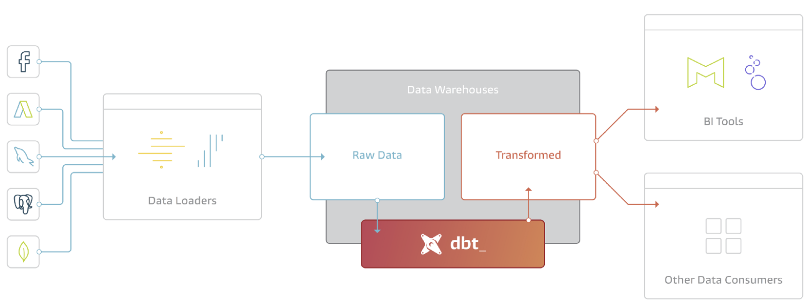

# Dbt BigQuery Integration Demo

Data Build Tool (dbt) is a cutting-edge open-source data modeling and transformation tool. It enables engineers and data analysts to transform and structure data in a dependable and scalable manner. Dbt is used to build data pipelines for data warehousing and business intelligence applications.

Dbt aids in automating the process of creating data models. Users can create SQL queries and use code to automate repetitive activities. Additionally, it provides functions like testing and version control that guarantee the consistency and accuracy of the data. Snowflake, Redshift, BigQuery, and other databases are among the many that dbt can operate with.

***Figure 1***

In this demo, we demostrate how to use the dbt with BigQuery for the SQL pipeline generation, test autumation and documentation generation. We also demostrate how to integrate the dbt with the orchestration serivce Cloud Composer, and how to implement the CI/CD process with dbt and Cloud Build.

